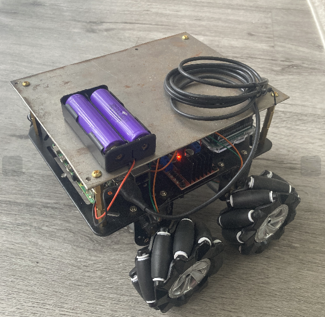
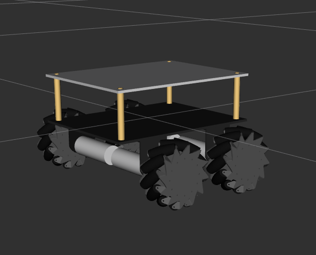
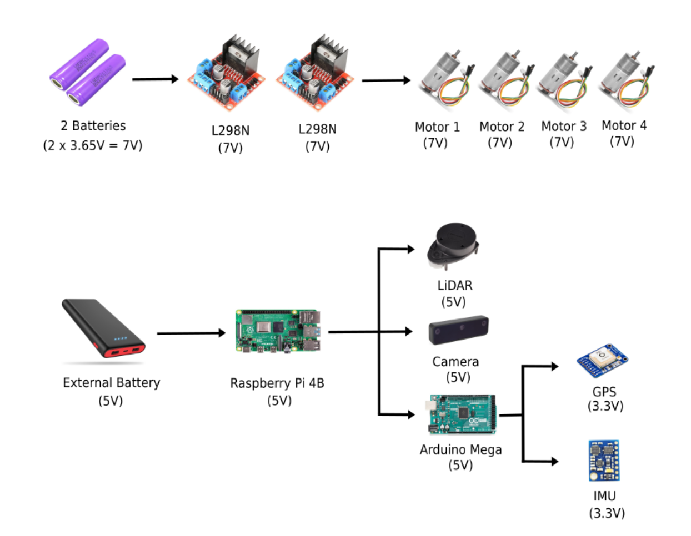
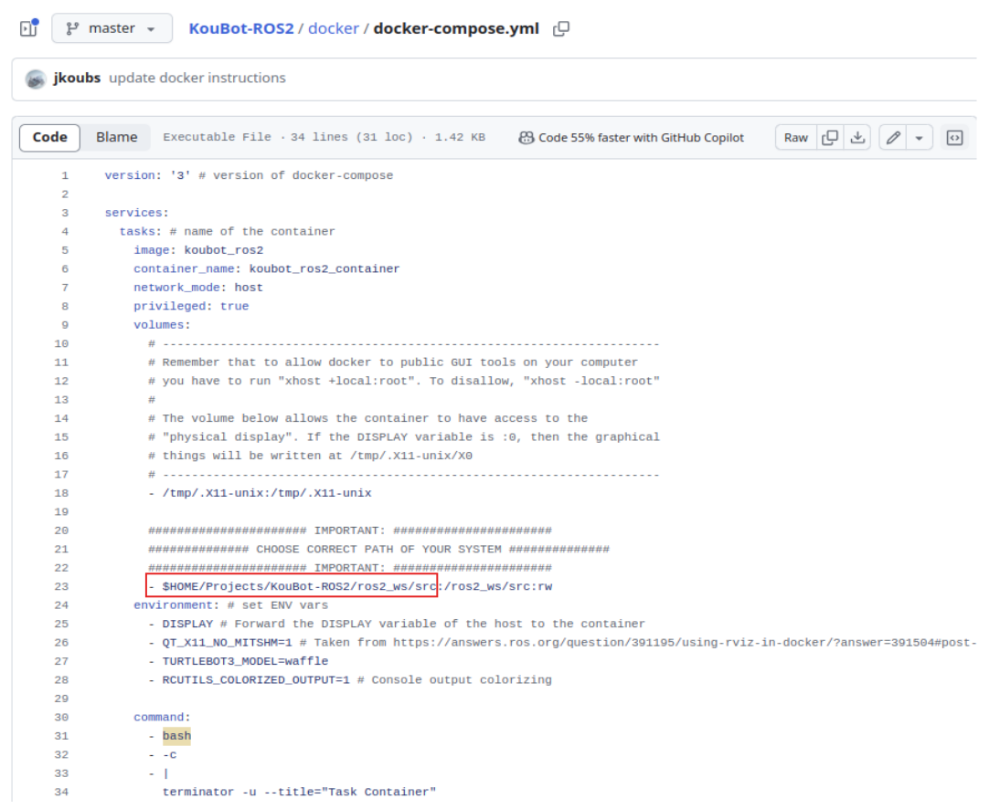

# This repository holds all the development work related to the KouBot Project done by me.

# Table of Contents
 - [About](#about)
    - [Project Goals](#project-goals)
    - [Key Features](#key-features)
    - [Power System](#power-system)
 - [Install](#install)
 - [Simulation](#simulation)
    - [Autonomous Navigation](#autonomous-navigation)
      - [Teleoperation](#teleoperation)
      - [Mapping](#mapping)
      - [Localization](#localization)
      - [Path Planning](#path-planning)
 - [Real Robot](#real-robot)
 - [What has been done](#what-has-been-done)
 - [Challenges](#challenges)

# About 

<div align="center">
  
</div>

<br>

Welcome to the <em>Koubot</em> project repository! <em>Koubot</em>  is an ambitious project aimed at developing an autonomous mobile robot equipped with **four mecanum wheels**, each powered by its own motor. This unique wheel configuration allows for omnidirectional movement, making <em>Koubot</em> highly maneuverable and capable of navigating complex environments with ease.

<br>

<div align="center">
  
</div>

## Project Goals

One of the primary goals of the <em>Koubot</em> project is to achieve advanced **sensor fusion**, integrating data from multiple sensors to enhance the robot's odometry. By fusing data from an IMU (Inertial Measurement Unit) and GPS, <em>Koubot</em> will be able to:


* Accurately detect and avoid obstacles
* Map and navigate unfamiliar environments
* Perform tasks autonomously with high precision

## Key Features


* **Computer**: Raspberry Pi Model B.

* **Software**: ROS 2 Galactic, Docker container, Gazebo, RViz.

* **Sensors**: LiDAR (RPLIDAR-A1M8 by Slamtec), Depth camera (OAK-D Lite), IMU (Adafruit - BNO055), GPS (Adafruit - Ultimate GPS Breakout v3).

* **Mecanum Wheel Configuration**: Each of the 4 wheels is driven by its own motor, enabling omnidirectional movement for versatile navigation.

* **Sensor Fusion**: Integrates data from IMU and GPS to improve odometry and overall navigation accuracy.


## Power System




<br>

The power system of <em>Koubot</em> is divided into two sections to ensure efficient and reliable operation:

* **Motor Power Supply**: This section is dedicated to powering the 4 motors that drive the mecanum wheels, providing the necessary torque and control for movement.

* **System Power Supply**: This section powers the computer and sensors, ensuring stable and continuous operation of the robot's processing and sensing capabilities.

# Install

## Launch container

We will build 2 images:
- <strong>galactic_tb_env</strong>: Allows to run turtlebot3 simulations in ROS 2 from a linux computer.
- <strong>koubot_ros2</strong>: Built on top of <strong>galactic_tb_env</strong> image to set up the ros2_ws for developing the KouBot project.

Open a new terminal and git clone the following repositories:
```bash
git clone https://github.com/jkoubs/ros2_galactic.git
git clone https://github.com/jkoubs/KouBot-ROS2.git
```
Then build the images:
```bash
cd ros2_galactic/docker
docker build -f Dockerfile -t galactic_env .
cd ../..
cd KouBot-ROS2/docker
docker build -f Dockerfile -t koubot_ros2 ../
```
<strong><em>Note</em></strong>: <strong>../</strong> represents the PATH context which sets the target context one level above to the <strong>koubot_ros2</strong> directory in order to successfully execute the COPY command from the Dockerfile which will copy the <strong>ros2_ws</strong> inside the container.


Next we will create the container:

<strong><em>Requirement</em></strong>: To run GUI applications in Docker on Linux hosts, you have to run <strong>"xhost +local:root"</strong>. To disallow, <strong>"xhost -local:root"</strong>. For Windows and Mac hosts please check : [Running GUI applications in Docker on Windows, Linux and Mac hosts](https://cuneyt.aliustaoglu.biz/en/running-gui-applications-in-docker-on-windows-linux-mac-hosts/). Can also found some more information about [Using GUI's with Docker](http://wiki.ros.org/docker/Tutorials/GUI).

```bash
xhost +local:root
```

**IMPORTANT NOTE:** Before running the container be sure to **edit the docker-compose.yml file and rename the path according to your local environment to properly mount your host directory into the container. Thus, you need to edit `$HOME/Projects/KouBot-ROS2/ros2_ws/src` to your own local path.**

<div align="center">
  
</div>

We can now run the image as a container named <strong>koubot_ros2_container</strong> using docker-compose :

```bash
docker-compose up
```

We are now <strong>inside the container</strong> and ready for executing our codes.

<u><strong><em>Note:</em></strong></u> For the next tasks we will consider that we are working from inside our container, in the <strong>ros2_ws</strong> workspace.


# Simulation

## Autonomous Navigation

### Teleoperation

Spawn the robot in Gazebo (Terminal 1):

```bash
cd /ros2_ws/
ros2 launch koubot_gazebo spawn_robot.launch.xml
```

Launch teleop node (Terminal 2):

```bash
ros2 run teleop_twist_keyboard teleop_twist_keyboard
```


Launch RViz (Terminal 3):


```bash
rviz2
```
**Note:** In RViz add the **Image** Display with the `/camera/image_raw` topic and choose **Best Effort** for the **Reliability Policy**. Also add the **PointCloud2** Display with the `/point_cloud_sensor/points` topic.


### Mapping

Launch the simulation (Terminal 1):

```bash
ros2 launch koubot_gazebo spawn_robot_ttbot3.launch.xml
```

Launch the slam node (Terminal 2):

```bash
ros2 launch koubot_slam slam.launch.py
```
**IMPORTANT:** In RViz, change the **Fixed Frame** to `/map` and add a `Map` Display with the appropriate topic named `/map`.


Now, using teleop, move the robot around to perform the map of the environment (Terminal 3):

```bash
ros2 run teleop_twist_keyboard teleop_twist_keyboard
```

Once you are done creating the map, save it (Terminal 4):

```bash
cd /ros2_ws/src/koubot_slam/maps/
ros2 run nav2_map_server map_saver_cli -f map
```

This will create two files (`map.yaml` & `map.pgm`) to represent the map. Those files are located inside the koubot_slam package:

```bash
koubot_slam/
  └── maps/
    ├── map.pgm
    └── map.yaml
```

<div align="center">
  
</div>

### Localization

Launch the simulation (Terminal 1):

```bash
ros2 launch koubot_gazebo spawn_robot_ttbot3.launch.xml
```

Launch the amcl node (Terminal 2):

```bash
ros2 launch koubot_slam amcl.launch.py
```
**IMPORTANT:** Once our localization node is launched, we need to set a `2D Pose Estimate` using Rviz. 


Now, using teleop, move the robot around and check how the localization pipeline works (Terminal 3):

```bash
ros2 run teleop_twist_keyboard teleop_twist_keyboard
```
<div align="center">
  
</div>

We can see that the particle filter shrinks over time which confirms that our localization is working properly.


### Path Planning

# Real Robot

In progress ..

# What has been done

## 1. Robot modeling (Using FreeCAD) + URDF

<div align="center">
  
</div>

## 2. Added teleoperation (able to teleop in simulation)


<div align="center">
  
</div>

## 3. Communicate with robot wheels using Arduino and Platformio

<div align="center">
  
</div>

## 4. Installed sensors on real robot (LiDAR + Camera + IMU)

## 5. Mapping done

# Challenges

## 1. Get GUI application working with remote machine

## 2. Communicate with motors and ROS 2

